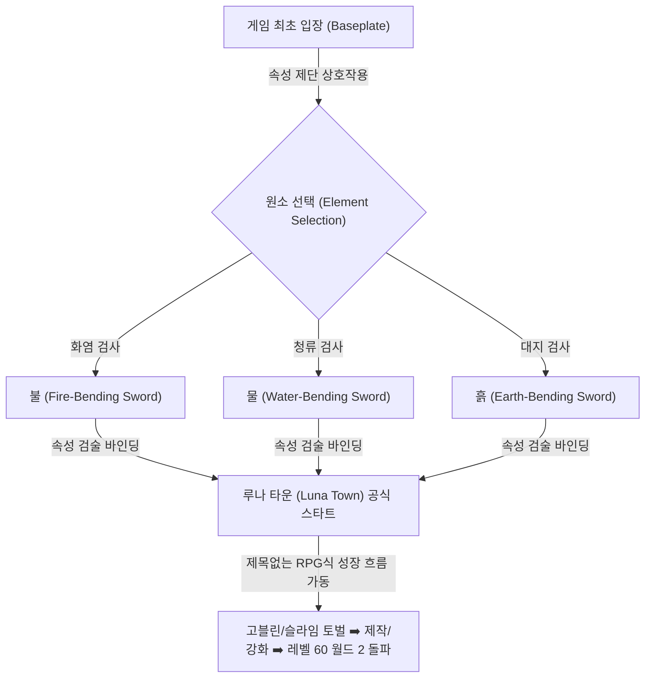

# 🏛️ 로블록스 '제목없는 RPG' 기반 아바타 검술 RPG 정밀 역기획 설계서
> **문서 코드**: `Avatar-Sword-RPG-RP-v5.0`  
> **상태**: 아바타 아앙의 전설 (흙, 물, 불 속성 선택식 검술) 기획 전면 융합 장식 완료  
> **설명**: 로블록스 '제목없는 RPG'의 독보적인 성장 동학(Luna Town, 무기 제작 품질 %, 강화 보호 주문서, 7% 보스 기여도, 레벨 60 월드 2 진입, 마나 순환 ➡️ 마나 코어)을 100% 동일하게 상속받고, '아바타 아앙의 전설(Avatar: The Last Airbender)'의 3대 원소 속성(흙, 물, 불) 선택식 검술 시스템을 결합한 신작 아케이드 RPG 정밀 설계 백서입니다.

---

## 1. ☯️ 세계관 및 스타팅 원소 선택 아키텍처 (Element Selection)

플레이어는 게임에 처음 입장할 때, 아무것도 없는 텅 빈 베이스플레이트 중앙의 원소 제단에서 **흙(Earth)**, **물(Water)**, **불(Fire)**의 세 가지 원소 검술 속성 중 하나를 선택하여 자신의 숙명(Bending Element)을 실시간 바인딩합니다.

---

## 2. ⚔️ 3대 속성별 검술 메커닉 및 단축키 명세 (Elemental Sword Skills)

무기는 '제목없는 RPG' 고유의 검(Sword)을 그대로 주 무기로 승계하되, 선택한 원소 속성에 동기화되어 평타 이펙트(VFX)와 스킬셋(E, R, T)이 완전히 차별화됩니다.

### 🔥 불 (Fire-Bending Sword) — 파괴적인 열풍과 지속 낙화
*   **평타 검흔 (LMB Slash)**: 화염의 흔적(Fire Trail) 이펙트. 적 타격 시 일정 확률로 **화상(Burn) 지속 도트 대미지** 디버프를 부여합니다.
*   **단축키 E (스킬 1 - 화염 돌풍 참격)**: 검을 전방으로 크게 휘둘러 화염 소용돌이 투사체를 사출해 경로 상의 몹들을 다타 타격합니다.
*   **단축키 R (스킬 2 - 불새의 도약)**: 공중으로 대시(Dash)하며 검을 아래로 내리쳐 주변 원형 범위에 대규모 화염 폭발 판정을 일으킵니다.
*   **단축키 T (스킬 3 - 태양의 일섬)**: 극도의 열기를 검에 집중해 전방의 적을 일직선으로 관통 베기하며 치명타(Critical) 확정 대미지를 가합니다.

### 💧 물 (Water-Bending Sword) — 수류의 연타와 마나 순환 증폭
*   **평타 검흔 (LMB Slash)**: 수류의 물결(Water Ripple) 이펙트. 적 타격 시 플레이어의 **마나(MP)를 추가로 수급(MP 흡수)**하여 대시와 스킬 운용 빈도를 폭증시킵니다.
*   **단축키 E (스킬 1 - 빙결 서리 칼날)**: 전방 부채꼴 범위에 수류 칼날을 발사하여 타격당한 몬스터들의 이동 속도를 3초간 50% 저하시킵니다.
*   **단축키 R (스킬 2 - 수룡의 격류)**: 검 끝에서 거대한 수룡 투사체를 발사해 전방의 적들을 한데 모아 밀쳐내며 다단 넉백 대미지를 부여합니다.
*   **단축키 T (스킬 3 - 절대 동결 참격)**: 전방의 단일 대상을 일시적으로 **빙결(Freeze - 행동 불능 1.5초)** 시키고 응축된 냉기 검격으로 파괴적인 마무리를 선사합니다.

### 🪨 흙 (Earth-Bending Sword) — 대지의 중압과 단단한 쉴드
*   **평타 검흔 (LMB Slash)**: 암석 파편(Stone Shard) 이펙트. 적 타격 시 타격 대미지의 일정 %만큼 **바위 방패(Earth Shield) 흡수막 게이지**를 일시 획득하여 단단하게 버팁니다.
*   **단축키 E (스킬 1 - 낙석 파쇄 참격)**: 검을 땅에 내리쳐 전방 세 방향으로 날카로운 바위 가시가 솟구치게 만들어 몹들을 공중에 에어본(Airborne) 시킵니다.
*   **단축키 R (스킬 2 - 대지 장벽 방벽)**: 검으로 대지를 이끌어내 전방에 바위 장벽을 임시 생성하여 적들의 다가오는 투사체를 차단하고 넉백을 무효화합니다.
*   **단축키 T (스킬 3 - 운석 파멸참)**: 하늘에서 거대한 암석을 칼 끝으로 인도하여 목표 낙하 구역의 모든 몹들을 강타하고 광역 스턴(Stun 1초)을 부여합니다.

---

## 3. 🎯 제작 및 강화 경제에 녹아드는 원소 전리품 (Elemental Crafting)

기존 '제목없는 RPG'의 무기 발전 루프에 아바타 속성이 자연스럽게 융합되어 재료 그라인딩의 목적성을 고도화합니다.

*   **원소 코어 드롭**:
    *   **슬라임/고블린** ➡️ 속성별 하급 원소 파편 (`Fire Fragment`, `Water Fragment`, `Earth Fragment`) 드롭 추가.
    *   **사막 미라/피라미드 수호자** ➡️ 중급 원소 에센스 (`Blazing Essence`, `Glacial Essence`, `Terra Essence`) 수급.
    *   **사무라이 / 성문 수호자** ➡️ 상위 등급의 검과 속성을 융합하기 위한 최종 핵심 전리품이자 합성 재료가 되어, 동일한 무기라도 **선택한 원소 속성의 특수 효과(도트 불, 수급 물, 보호막 흙) 배율**이 제작 품질 %와 함께 무작위 가공되도록 설계합니다.
