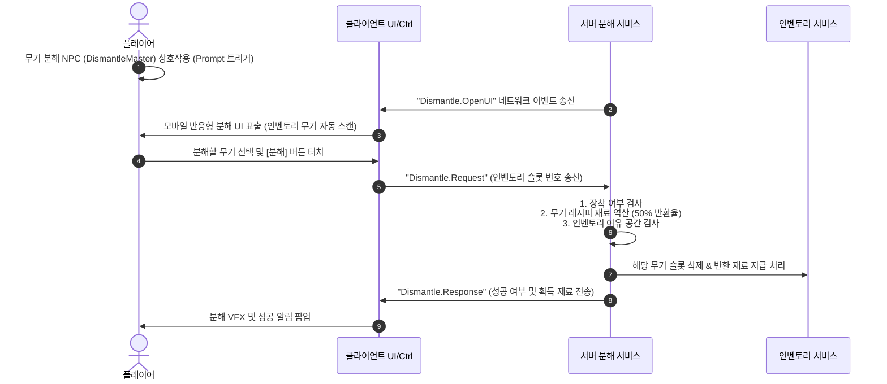

# 🔨 [구현 계획서] 무기 분해 NPC 및 모바일 반응형 UI 시스템 구축 (NPC 전용)

유저님의 지시에 따라 튜토리얼 작업을 배제하고, 오직 **[무기 분해 NPC 상호작용 및 전용 모바일 반응형 UI 시스템]** 구축만 독자적으로 수행하는 전용 구현 계획서입니다.

---

## 🎨 1. 무기 분해 NPC 및 모바일 반응형 UI 스펙

기존 무기제작 및 강화 UI를 레퍼런스로 삼아, **네이비/블랙 반투명 글래스모피즘 테마**를 계승하되 **모바일 디스플레이 환경(가로/세로 비율)에서 리스트와 세부 카드가 유기적으로 동작하도록 반응형 구조**로 설계합니다.

### 📐 레이아웃 사양
*   **PC 환경 (대화면)**: 가로 2분할 레이아웃
    - **왼쪽 (60%)**: 인벤토리 내 분해 가능한 무기 목록 ScrollList (그리드 형태)
    - **오른쪽 (40%)**: 선택한 무기 상세 정보 카드 및 **[분해 시 획득할 예상 재료 목록]** + **[무기 분해 실행]** 버튼
*   **모바일 환경 (소화면)**: 1행 배치 또는 자동 스택 레이아웃
    - 모바일의 좁은 화면 비율을 위해, `UIListLayout` 및 `AspectRatio` 제어를 통해 리스트 크기를 유연하게 보정하고, 선택 창과 결과 창이 상하로 스택되거나 겹침 현상 없이 꽉 차게 렌더링되도록 처리합니다.
*   **비주얼 스타일**:
    - `BackgroundTransparency = 0.15`
    - 테두리: 선명한 라이트 블루/네이비 (`Color3.fromRGB(60, 85, 130)`)
    - 마이크로 인터랙션: 버튼 터치 시 미세 스케일 바운스 피드백 (`0.95` -> `1.0` 스케일 트윈)

---

## ⚙️ 2. 아키텍처 및 네트워크 흐름

NPC 상호작용부터 서버 검증 및 재료 반환까지의 유기적인 데이터 통신 구조입니다.



---

## 🛠️ 3. 파일별 변경 설계 및 신규 개발 범위

### [1] ReplicatedStorage (공용 프로토콜 추가)

#### 📝 [MODIFY] [Protocol.lua](file:///c:/YJS/Roblox/RPG/src/ReplicatedStorage/Shared/Net/Protocol.lua)
*   `Protocol.Commands` 테이블 내에 분해 요청 명령어 바인딩 추가:
    ```lua
    ["Dismantle.Request"] = true
    ```

---

### [2] ServerScriptService (서버 로직)

#### 📝 [NEW] [DismantleService.lua](file:///c:/YJS/Roblox/RPG/src/ServerScriptService/Server/Services/DismantleService.lua)
*   **NPC 자동 바인딩**: Workspace 내 `"DismantleMaster"` / `"무기분해"` 모델을 자동 감지하여 `ProximityPrompt` 자동 부착.
*   **분해 알고리즘**:
    - 분해 대상 무기의 ID를 기반으로 `RecipeData.lua`에서 원본 제작법의 투입 재료를 자동으로 역산합니다.
    - **반환 수량**: 원본 투입 재료의 **50% (소수점 버림)**를 기본 반환하며, 최소 1개는 무조건 반환합니다.
    - 장착 중인 무기는 오작동을 방지하기 위해 분해가 불가능하도록 강력히 차단합니다.
    - 분해 완료 시 무기 삭제 및 재료 지급을 원자적(Atomic)으로 처리합니다.

#### 📝 [MODIFY] [ServerInit.server.lua](file:///c:/YJS/Roblox/RPG/src/ServerScriptService/ServerInit.server.lua)
*   서버 초기화 시 `DismantleService` 모듈 로드 및 초기화 코드 추가.

---

### [3] StarterPlayerScripts (클라이언트 로직 및 UI)

#### 📝 [NEW] [DismantleController.lua](file:///c:/YJS/Roblox/RPG/src/StarterPlayer/StarterPlayerScripts/Client/Controllers/DismantleController.lua)
*   `Dismantle.OpenUI` 신호를 받아 `UIManager`를 통해 분해 UI 기동.
*   서버에 `Dismantle.Request` 통신을 요청하고 결과를 받아 UI에 전달.

#### 📝 [NEW] [DismantleUI.lua](file:///c:/YJS/Roblox/RPG/src/StarterPlayer/StarterPlayerScripts/Client/UI/DismantleUI.lua)
*   네이비/블랙 글래스모피즘 스타일의 단독 팝업 창 빌드.
*   현재 인벤토리의 무기 목록을 세련된 그리드로 렌더링.
*   **반응형 레이아웃**: 모바일 터치 및 해상도 변화 시 카드와 그리드 사이즈를 유연하게 배분.
*   선택 무기 클릭 시 반환 재료의 아이콘과 수량을 럭셔리하게 시각화.

#### 📝 [MODIFY] [UIManager.lua](file:///c:/YJS/Roblox/RPG/src/StarterPlayer/StarterPlayerScripts/Client/UIManager.lua)
*   `UIManager.openDismantle()` 및 `UIManager.closeDismantle()` 생명주기 관리 함수 통합.
*   분해 UI 프리-레이아웃 마운트 처리.

#### 📝 [MODIFY] [ClientInit.client.lua](file:///c:/YJS/Roblox/RPG/src/StarterPlayer/StarterPlayerScripts/ClientInit.client.lua)
*   `DismantleController` 초기화 루틴 등록.
